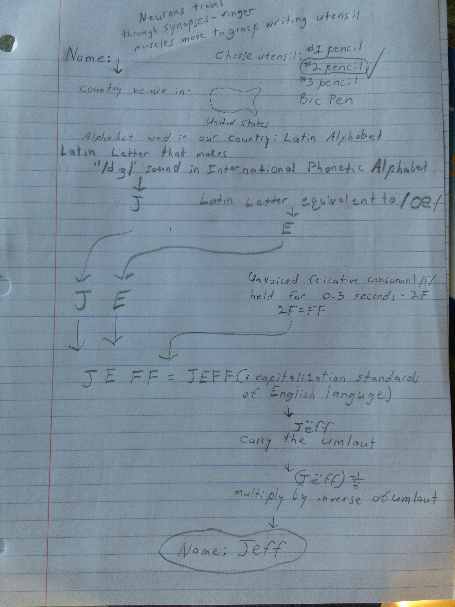
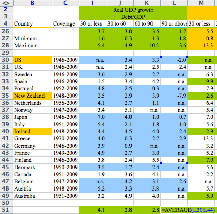
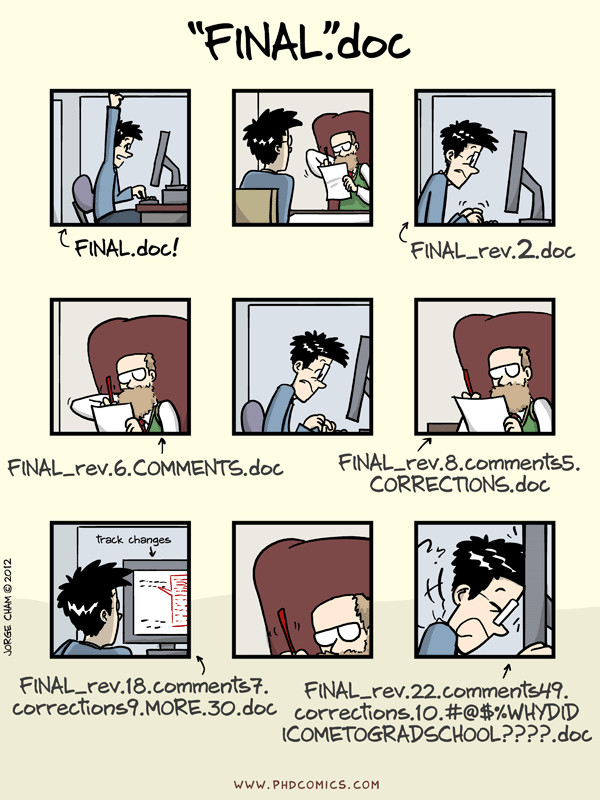
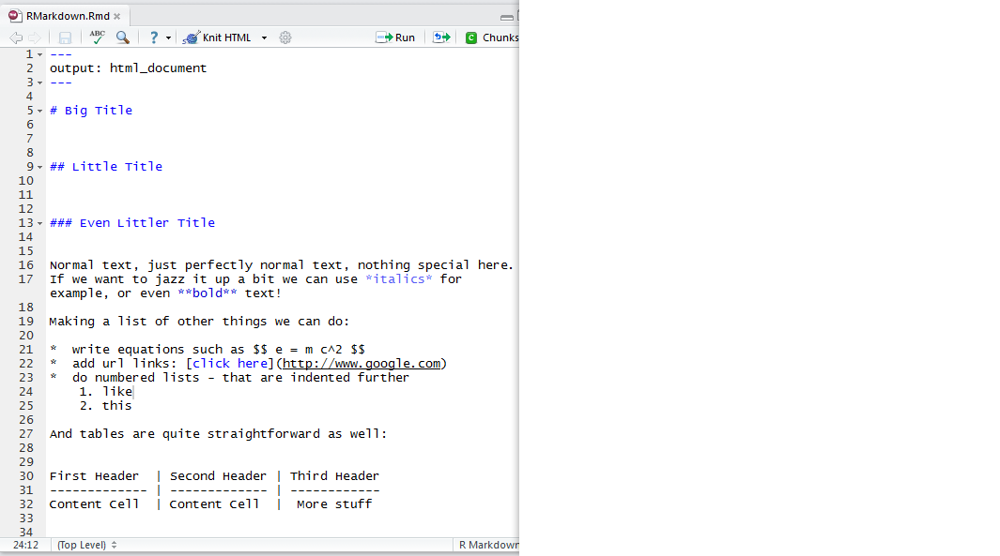
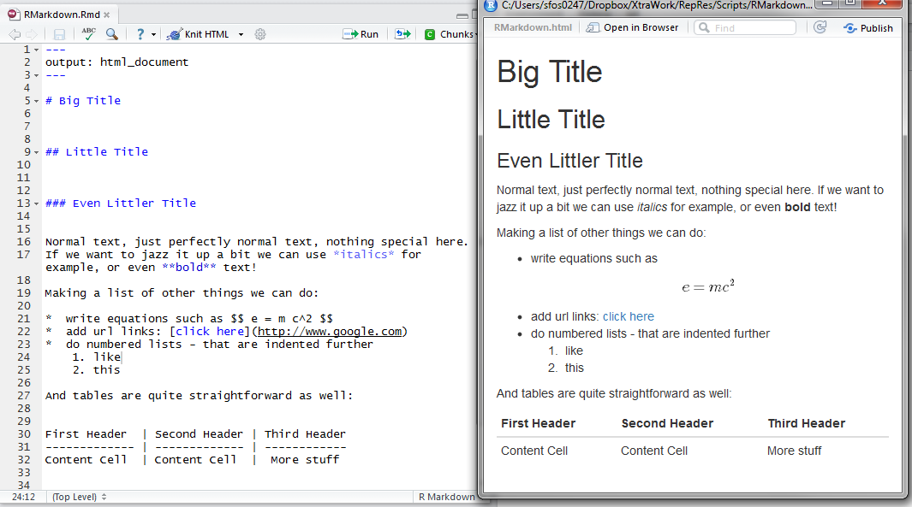

```{r, load_refs, include=FALSE, cache=FALSE}
library(RefManageR) 
BibOptions(check.entries = FALSE,
           #bib.style = "alphabetic",
           cite.style = "authoryear",
           style = "markdown",
           hyperlink = FALSE,
           dashed = FALSE)
myBib <- ReadBib(here::here("data/dictionaries/lit.bib"), check = FALSE)
```

# Outline of this talk

???

OK, so I should probably introduce myself briefly here? 
--

`1.` Reproducibility: *What?*


???

So first of all we should try to get on the same playing field, I want to briefly talk about what Reproducibility is, what we mean by reproducible research. 
--

`2.` Reproducibility: *Why?*

???

Next i will talk about WHY reproducible research is important, why it should be important to you

--

`3.` Reproducibility: *Where?*


???

By where I mean "in the humanities", so I'll briefly touch on how we think about reproducibility in computational fields and in non-computational fields, although the focus of the talk is of course the former. 

---
# Outline of this talk

`1.` Reproducibility: *What?*


`2.` Reproducibility: *Why?*


`3.` Reproducibility: *Where?*


`4.`  Reproducibllity: *How?*

???

Now for the gist of the talk, what are the principles of reproducibility and which tools do we use to make the whole workflow reproducible, from the data gathering, to its analysis and finally its presentation.

--

* *Principles*
    
* *Tools*

???

So within the how we will discuss the principles which underpin reproducibility in practice such as open data, scripting your analysis, segmentation, and transparency, and also some of the tools that make this process easier to manage and help you setup a reproducible workflow. 

I will discuss in particular R and Rstudio, git and make and knitr. 

Now just to be clear about the aims of this talk: it is tricky with a target audience like you guys with a variety of levels of experience and interest. So what I have tried to do is focus more on the principles instead of the practicalities of the tools. 

I have also not gone in the other direction of broadening the focus to include mentions of all possible alternative tools. This is partly because I don't know them well from personal experience, and partly because I truly think R and Rstudio are one of the strongest reproducible research environments available. But don't worry if you are a python user or planning on becoming one, you'll be fine. 

But even if you are not an R user, and never intend to become one, I think you should still get something useful out of it, perhaps seeing an implementation of one of the principles might spur you to find an analogous solution that applies better to your setup. 

---

# What is Reproducibility?

* Reproducibility vs Replicability or Replication?

???


OK, so first of all I want to make it clear what I mean by reproducibility. In particular in relation to replicability or replication of research. The thing is that both these terms are very often used interchangeably and that can sometimes lead to confusion. So here's the way I will use them here. 
---

# What is Reproducibility?

* Reproducibility vs Replicability or Replication?

* Replication: *"The confirmation of results and conclusions from one study obtained independently in another"*
.right[ `r Citep(myBib, "Jasny1225")`]

???
We generally understand replication and reproducibility to be the golden standard of scientific research. Here's a definition I like this is for replication: "The confirmation of results and conclusions from one study obtained independently in another". This is from the editorial to a special issue of Science dedicated to "Data replicability and reproducibility". 
---

# What is Reproducibility?

* Reproducibility vs Replicability or Replication?

* Replication: *"The confirmation of results and conclusions from one study obtained independently in another"*
.right[ `r Citep(myBib, "Jasny1225")`]

* Reproducibility: *"[T]he independent verification of prior findings"*
.right[`r Citep(myBib, "Santer1232")`]

???
Here's another good one from the same issue, which is even more condensed: "[T]he independent verification of prior findings", although they are talking about reproducibility here. So like I said, even within the specialists dealing with this topic the terms seem to get mixed and interpreted synonymously quite often.

---

# What is Reproducibility?

* Reproducibility vs Replicability or Replication?

* Replication: *"The confirmation of results and conclusions from one study obtained independently in another"*
.right[ `r Citep(myBib, "Jasny1225")`]

* Reproducibility: *"[T]he independent verification of prior findings"*
.right[`r Citep(myBib, "Santer1232")`]

**Levels of Replication :**

???

So when I talk about replication I mean it in the broad sense relating to findings and conclusions. But within that I think we can speak of several layers or levels of replication.
---

# What is Reproducibility?

* Reproducibility vs Replicability or Replication?

* Replication: *"The confirmation of results and conclusions from one study obtained independently in another"*
 .right[ `r Citep(myBib, "Jasny1225")`]

* Reproducibility: *"[T]he independent verification of prior findings"*
 .right[`r Citep(myBib, "Santer1232")`]

**Levels of Replication :**

1. Re-ask the question

???

The first level is to re-ask the question from scratch and attempt to confirm a finding or conclusion with a whole new experiment.
--

2. Re-do the experiment

???

The second is to redo an experiment - trying to follow the original methods as closely as possible.
--

3. Re-analyse the data

???

The third level is to re-analyse the data from an experiment - using different methods, models what have you.
---

# What is Reproducibility?

* Reproducibility vs Replicability or Replication?

* Replication: *"The confirmation of results and conclusions from one study obtained independently in another"*
.right[ `r Citep(myBib, "Jasny1225")`] 

* Reproducibility: *"[T]he independent verification of prior findings"*
.right[`r Citep(myBib, "Santer1232")`] 

**Levels of Replication :**

1. Re-ask the question

2. Re-do the experiment

3. Re-analyse the data

4. **Reproduce** the results


???

And finally, the strictly narrow sense of reproducibility is reproduce an analysis - using the exact same data, same methods and techniques.

And it's essentially only the last type of replication that I'm talking about here. Sometimes these are also called **pure replications** or **close replications**, but whatever you want to call them, that is what I'm talking about.

Of course some of the principles of reproducibility apply to the broader levels as well, data has to be openly available if anyone is to re-analyse it with their own methods. And experimental methodology must also be documented transparently if anyone is going to replicate your experiment.

But the gist of reproducibility as understood here is ensuring that your results are reproducible using the same data and methods you used.

---

# What is Reproducibility?

* Reproducibility vs Replicability or Replication?

* Replication: *"The confirmation of results and conclusions from one study obtained independently in another"*
.right[ `r Citep(myBib, "Jasny1225")`]

* Reproducibility: *"[T]he independent verification of prior findings"*
 .right[`r Citep(myBib, "Santer1232")`]

**Levels of Replication :**

1. Re-ask the question

2. Re-do the experiment

3. Re-analyse the data

4. **Reproduce** the results

Reproducible workflow: gathering -> analysis -> presentation

???
So to be more concrete, we want to ensure that our whole research workflow, which starts with the gathering of the data, then the analysis and finally the presentation of the results, are reproducible.

---
*Reproducibility means showing your work: *

--

 .right[(imgur user TVsJeff)]

```{r imgur1, echo=FALSE, fig.cap="Show your work *ad absurdum*", fig.height=5}

```

???
So the sort of reproducibility that I'm talking about is about "showing your work". And yes, that can sometimes be the most annoying thing in the world. As in this example here, where a user on imgur vented his annoyance at his maths teacher who wanted him to show his work by taking it to a really extreme conclusion. I'm not sure if you can see this very well, this starts with "Neurons travel through synapses, finger muscles move to grasp writing utensil" and this whole page is just to describe the work that went into writing his name on the homework. And apparently this is followed by 44 more pages like this one.

So obviously this is a bit of an extreme example, but my point is that honestly yes, ensuring your analysis is really reproducible can be quite annoying, and it can seem pointless and unnecessary.

---
*Reproducibility means showing your work: *

 .right[(imgur user TVsJeff)]

```{r imgur, echo=FALSE, fig.cap="Show your work *ad absurdum*", fig.height=5}

```

???

BUT it is worth the hassle in the end. And it will be less of a hassle if you plan systematically on doing it from the start instead of thinking about it retrospectively and trying to fix it after the fact.

And furthermore that doing truly reproducible data analysis has become easier and easier with a variety of tools not only being available, but being accessible, free and relatively easy to use.
---

# Why should research be reproducible?

???
So why would we want it to be reproducible?

--

`1.` For science:

--
* opens claims to scrutiny

???

This is one way of distinguishing science---in the positivist sense anyway---from non-science. This is generally considered the ultimate standard for evaluating scientific claims: whether they can be verified through replication.

---

# Why should research be reproducible?

`1.` For science:

* opens claims to scrutiny

* helps avoid duplication and encourage accumulation of knowledge

???

As a way to further cumulative scientific knowledge, reproducible research cuts down on duplication of effort by allowing scientists to share data or procedures instead of them having to discover things that have already been done by others on their own.

---

# Why should research be reproducible?

`1.` For science:

* opens claims to scrutiny

* helps avoid duplication and encourage accumulation of knowledge

`2.` For you:

???
I cannot overstate this enough. Despite the sometimes large upfront investment into learning the tools and setting up your work process, it is worth it even just for making your life a lot easier in the long run

---

# Why should research be reproducible?

`1.` For science:

* opens claims to scrutiny

* helps avoid duplication and encourage accumulation of knowledge

`2.` For you:

* forces you to develop better working habits

???

Better work habits mean you are more effective, better organised, produce higher quality work and fewer errors. You're also avoiding personal effort duplication and building your own knowledge base more effectively.

---

# Why should research be reproducible?

`1.` For science:

* opens claims to scrutiny

* helps avoid duplication and encourage accumulation of knowledge

`2.` For you:

* forces you to develop better working habits

* makes changes and updates of your work easier

???
most research is an iterative process where you keep going back and rerunning parts of your analysis, not a linear one off. additionally you might want to get back to your research after several years have passed and update it with newly available data. reproducible research makes that so much easier. 

I'm sure we've all been in the position---i certainly have---of going through an old folder for a project of mine, scratching my head trying to figure out what i was trying to do. if you recognize yourself in that, you definitely need to apply some principles of reproducible research to your workflow.

---

# Why should research be reproducible?

`1.` For science:

* opens claims to scrutiny

* helps avoid duplication and encourage accumulation of knowledge

`2.` For you:

* forces you to develop better working habits

* makes changes and updates of your work easier

* increases your research impact

???
How? Well your research will be more useful to more researchers than if it were not reproducible. It contains more information, it is more likely to be looked at and lead to other research, which means citations of your work.

---

# Why should research be reproducible?

`1.` For science:

* opens claims to scrutiny

* helps avoid duplication and encourage accumulation of knowledge

`2.` For you:

* forces you to develop better working habits

* makes changes and updates of your work easier

* increases your research impact

* enables easier teamwork

???
Making your work more accessible to collaborators makes it easier to build knowledge together.

--

.right[`r Citep(myBib, "gandrud2016reproducible")`]

???
This outline is from a wonderful book by Christopher Gandrud on reproducible research with R and Rstudio, which I highly recommend as a great hands on introduction to the topic by the way.

---

# Reproducibility in the Humanities?


???

So, I'm a social scientist. A demographer to be more precise, but anyway, the point is I don't really know much about the humanities. And yet I'm fine with telling you about reproducibility and why it's important, without having to know much about the field.

--

* reproducibility is not limited to any branch of science

???

The thing is reproducibility isn't endemic or native to social sciences either. It is an ideal for all research, all scientific endeavor to strive towards. It distinguishes science from non science by opening claims to scrutiny.

As a guiding principle the idea of reproducible research has its stronghold in quantitative research. Research which uses numbers and statistical techniques to obtain results.

---

# Reproducibility in the Humanities?


* reproducibility is not limited to any branch of science

* but focus is nevertheless on computational research

???

Many of the tools and techniques I will discuss today actually stem explicitly from the fields of computational research: they are tools that programmers and developers use themselves. Their efficiency, especially when it comes to collaborative work, depends on being transparent, being able to show their work, being able to systematic about their workflow.

And these tools have been appropriated by quantitative scientists, including in the social sciences and increasingly so in the humanities. In this talk I will mainly focus on this sort of reproducibility: of the workflow for computational research including the gathering, analysis and presentation of results.

In this respect the humanities are no different from the social sciences or from the natural sciences. The same principles apply and for the most part the same tools. 

---

# Reproducibility in the Humanities?


* reproducibility is not limited to any branch of science

* but focus is nevertheless on computational research

* what about qualitative research?

???

Without getting into the philosophy of science too much, it is of course clear that both the sort of reproducibility and replicability that we defined earlier, are based on a positivist view of science.

Qualitative research does not necessarily follow that, but might be based on an interpretative research method where by definition the conditions of the study are impossible to recreate.

However this doesn't mean we have to revert to the sort of solipsism where only the author understands how the findings were achieved.

---

# Reproducibility in the Humanities?


* reproducibility is not limited to any branch of science

* but focus is nevertheless on computational research

* what about qualitative research?

* Transparency

???

Instead we should use the transparency of the research process to judge the rigor of qualitative research.

--

    1. Production transparency

    2. Data transparency

    3. Analytic transparency


.right[`r Citep(myBib, "moravcsik_2014")`]
???

Following Moravscik we can speak of three dimensions of transparency:

Production transparency gives information on how the data was produced, gathered and collected.

Data transparency affords readers access to the data used to support the findings.

Analytic transparency gives readers detailed information on the methods of analysis used to interpret the data.

Now although these three types of transparency do not afford the full reproducibility in the narrow sense we discuss above, they do provide enough information to fairly evaluate a study by.

So while this information might not make the research reproducible in the narrow sense of the word, it is the necessary requirement for reproducibility of all research.

# Reproducibility in the Humanities?


* reproducibility is not limited to any branch of science

* but focus is nevertheless on computational research

* what about qualitative research?

* Transparency

???

Instead we should use the transparency of the research process to judge the rigor of qualitative research.

--

    1. Production transparency

    2. Data transparency

    3. Analytic transparency


.right[`r Citep(myBib, "moravcsik_2014")`]

* *cf.* [Annotation for Transparent Inquiry](https://qdr.syr.edu/ati)

???
Furthermore many of the principles that I want to discuss now, still apply to qualitative research, although perhaps not all of the tools. With regard to tools though I would suggest you look at the Annotation for Transparent Inquiry which is an approach to presenting qualitative research in a more transparent way by allowing rich annotations and linking of sources and citations.

---

# Why Tools matter

???

Before we move to discuss the tools for reproducible research, I want to give a quick example of why tools are so important. And I'll try to not make this a militant anti-Excel screed, but instead a thinly veiled anti-Excel screed.


SO I wanted to mention a rather famous story in the history of reproducible research, this one is from the field of macroeconomics. So Carmen Reinhart and Kenneth Rogoff wrote a rather famous paper in 2010 seemingly proving that high levels of GDP suppresses economic growth in countries. Now this was just after the economic crisis and this paper became quite popular as a means of arguing for austerity measures.
--

```{r rrexcel1, echo=FALSE, fig.cap="Encouraging errors", out.widht = '70%', out.height='70%'}

```
???

They had not made their data or their analysis freely available, but an american grad student Thomas Herndon was persistent enough in emailing them, that Carmen finally did send him the spreadsheet they used.

And when he looked at it, he found this, the average calculated for this column here, for countries with a debt ratio of 90 percent or more - the average was not calculated for the whole column, but missed five cells at the bottom there.

Which is what happens in Excel. I'm sure you've all done it, dragged across some cells without much control or precision. I know I've definitely done it.

In fact this error - although it got most of the press - didn't actually change the results dramatically, but Herdon was able, once he got hold of the spreadsheet, to also understand how the analysis was conducted and he and many other people agreed that the method of weighting the data was very unorthodox.


---

# Why Tools matter

```{r rrexcel2, echo=FALSE, fig.cap="Encouraging errors", out.widht = '70%', out.height='70%'}

```
???

Because effectively they averaged the growth rates regardless of how long they lasted. so the New Zealand growth rate here, -7.9 only lasted a year, but has the same weight as Greece's for example, which I don't know how long it lasted, but I'm pretty sure their debt ratio has been pretty bad for a long time.

Anyway, I just thought I'd mention this story as one about the importance of being transparent and open with your data and analysis, and partly as a cautionary tale about using Excel. Or I should say spreadsheet programmed in general.

Oh, also there was the story recently about the genetic analyses being wrong because some gene names were misinterpreted by Excel as dates. SO there are gene names such as SEPT2, which got routinely transformed into second of September.

Look, I know for a lot of you Excel in a super comfortable go-to programme that gets the job done. And I do think it has its place. But I would very strongly advise against using it in any of your research. But I won't argue too hard against using spreadsheets for prototyping.

---

# Principles and Tools for Reproducible Research

???

OK, so let me first outline a set of principles that underlie RepRes that I want to talk about to you today, and some useful tools
--

.left-column[
  * *Scripting* your analysis
]
.right-column[
  * `R` (but also e.g. python..)

]

???

One of the most important principles that underpins analytic transparency is Scripting.
 
Scripting essentially means executing your work process using code, which can be rerun. 

---

# Principles and Tools for Reproducible Research

.left-column[
* *Scripting* your analysis

* *Data Transparency* or *Open Data*
]
.right-column[
* `R` (but also e.g. python..)

* fighsare, institutional repositories..
]

???
Having your data openly available to other researchers, both ensuring the data sources are adequately described, but also the datasets produced by your analysis made available in stable format.

---

# Principles and Tools for Reproducible Research

.left-column[
* *Scripting* your analysis

* *Data Transparency* or *Open Data*

* *Version Control*
]
.right-column[
* `R` (but also e.g. python..)

* fighsare, institutional repositories..

* git and GitHub
]

???
Next we have version control. Version control is a management system that is used to keep track of changes in your files. It is particularly important if your research process is not completely linear. And we know it usually isn't. Version control also provides some element of backup and cloud storage, but this isn't its primary purpose.

---

# Principles and Tools for Reproducible Research

.left-column[
* *Scripting* your analysis

* *Data Transparency* or *Open Data*

* *Version Control*

* *Literate programming*
]
.right-column[
* `R` (but also e.g. python..)

* fighsare, institutional repositories..

* git and GitHub

* `knitr` & markup languages
]

???
With literate programming we are already in the presentation/publication/dissemination side of reproducible research, the idea here being that you can combine your text, the formatting and your analytic code in one human readable document that produces your desired output.


---

# Principles and Tools for Reproducible Research

.left-column[
* *Scripting* your analysis

* *Data Transparency* or *Open Data*

* *Version Control*

* *Literate programming*

* *Consistency* and *documentation*
]
.right-column[
* `R` (but also e.g. python..)

* fighsare, institutional repositories..

* git and GitHub

* `knitr` & markup languages

* style guides, analysis journals, comments, `packrat`
]

???

Finally the more generic principles of consistency and documentation, don't really have any specific tools, but are usually proscribed to some extent by coding style guides. By consistency I mean e.g. consistent file and variable naming conventions.. And by documentation everything from code comments, variable descriptions and metadata, as well as work process documentation in particular citing the software used. `packrat` is additionally an R package that allows you to create a portable and isolated project that cannot be "broken" by future updates or changes.

---

# Principles and Tools for Reproducible Research

.left-column[
* *Scripting* your analysis

* *Data Transparency* or *Open Data*

* *Version Control*

* *Literate programming*

* *Consistency* and *documentation*

* *Modularity* and *segmentation*
]
.right-column[
* `R` (but also e.g. python..)

* fighsare, institutional repositories..

* git and GitHub

* `knitr` & markup languages

* style guides, analysis journals, comments, `packrat`

* GNU Make
]
???

The next principle is to organize your file structure and your whole workflow into modular files and describing how the files are connected together in a systematic way. GNU Make in particular is a valuable tool that allows you to execute your whole analysis at once, while keeping track of changes to individual files.
---

# Principles and Tools for Reproducible Research

.left-column[
* *Scripting* your analysis

* *Data Transparency* or *Open Data*

* *Version Control*

* *Literate programming*

* *Consistency* and *documentation*

* *Modularity* and *segmentation*

* *Convenience*
]
.right-column[
* `R` (but also e.g. python..)

* fighsare, institutional repositories..

* git and GitHub

* `knitr` & markup languages

* style guides, analysis journals, comments, `packrat`

* GNU Make

* **RStudio**
]

???

I kind of made this last one up, convenience as a principle of Reproducible research.. it obviously isn't a principle or reproducibility, but it is a principle of mine.. The reason I added it here is because of RStudio. Namely RStudio is what is technically called an integrated development environment, for using R, but it now includes capabilities for integrating all the tools mentioned above and in many cases making them a lot simpler to use than they would have been otherwise.

---

# Scripting languages---R

???

Scripting your analysis is one of the most basic principles of producing reproducible research. Scripting means you are able to answer the most important question for reproducibility: What did you do?

* What did you do?

--

Remembering what you did, what steps you took in your analysis is a huge tripping point when it comes to retracing your steps. And if you used any sort of point and click steps, it becomes nearly impossible.


---

# Scripting languages---R

* What did you do?

    * Download data

???
Maybe you downloaded the data from somewhere? Did you just click on a link and save it to your Downloads folder? That's a surefire way of loosing track of where you got your data from and which dataset you actually used.


---

# Scripting languages---R

* What did you do?

    * Download data

    * Data editing

???

Maybe you looked at the data and did some quick edits right off the bat? Removed a header row? Changed a variable name? Changed a missing value to a zero? That's also not reproducible. Unless you scrupulously documented every move you made with your mouse and every key you typed with your keyboard, it will be impossible for anyone coming after you, including yourself, to repeat what you have done.

---

# Scripting languages---R

* What did you do?

    * Download data

    * Data editing

    * Data analysis


???
After the data cleaning and editing you start your analysis. If you are not using a scripting language you are probably running your analysis using menus, checking tick boxes and selecting subroutines from drop down menus. Or maybe it means copy/pasting columns or writing formulas into cells by dragging your mouse to select data ranges..

The order in which you did these things is also important, and you really have no reasonable way of recording it.

---

# Scripting languages---R

* What did you do?

    * Download data

    * Data editing

    * Data analysis

    * Data visualization

???
Finally you might have visualized your data in some way, to produce a chart, or a map for example. In most visualization software this is a process that is exclusively done in the graphical user interface. You clicked on chart elements to highlight them and change their colours, the widths of lines, etc. Have you ever spent a really long time trying to get your chart to be just perfect, only to then realise you had to do it all again for a new set of data, and getting frustrated when the colours don't match, or you cannot remember the exact styles and formatting you used the first time around?
---

# Scripting languages---R

* What did you do?

    * Download data

    * Data editing

    * Data analysis

    * Data visualisation

* Scripting:

    * Makes your life easier during your analysis


???

This is where scripting comes in. Scripting languages, such as R, python or Perl, allow you to explicitly write the code for each step of your data gathering process, data cleaning and editing, your analysis and the visualisation.

You can see how this might make your life a whole lot easier. It means the whole process is immediately repeatable, even by you. This is one of the most immediate benefits of moving to a scripted workflow, we've all been there where you have to repeat the same steps several times as you iterate through your analysis and tweak it.

---

# Scripting languages---R

* What did you do?

    * Download data

    * Data editing

    * Data analysis

    * Data visualisation

* Scripting:

    * Makes your life easier during your analysis

    * Makes everyone else's life easier after your analysis

???

If you use a scripting language you avoid this issue completely. And of course the benefits do not only accrue to you, you have also recorded for posterity your work. For the reviewers of your work, for your readers, for anyone, including yourself, who might want to build on your work.


---

# Scripting languages---R

* What did you do?

    * Download data

    * Data editing

    * Data analysis

    * Data visualisation

* Scripting:

    * Makes your life easier during your analysis

    * Makes everyone else's life easier after your analysis

* Why R?

???

Well, I'm not here to sell R to you, but I will say that it fulfills the scripting criteria very well. It is an increasingly popular data analytic language, and is becoming more user friendly and more powerful every year. It is also open source, which means you are not tied to any commercial licences, and has a wonderful community of users. But if you are e.g. a python user then you really have no reason to switch.

A huge strength of these two languages are their broader development environments which allow easy integration of all of the other tools for reproducibility we will discuss today. With R this comes in the form of RStudio, which I will discuss towards the end.

---

# Scripting languages---R

* What did you do?

    * Download data

    * Data editing

    * Data analysis

    * Data visualisation

* Scripting:

    * Makes your life easier during your analysis

    * Makes everyone else's life easier after your analysis

* Why R?

???

But there are also second best solutions that should not be scoffed at. If you are for example an SPSS user, there is a relatively straightforward way to start scripting your work without even learning a new programming language. SPSS lets you copy the syntax code for any command you are about to execute and place it instead into a script file, and run it from there. So if any of you have been trained in SPSS and feel relearning a whole new statistical software might not be worth your while, you can get pretty decent scripting from SPSS, although I don't think you'll do that well on some of the other topics we will discuss. But that's still better than nothing!


---

# Open Data---figshare and other repositories

???

You cannot really talk about reproducible research and not mention open data. However I don't want to spend too much time on this, since it feels like so much of this information is already out there. 

--

* Open data in the narrow sense

* Open data in the broad sense

???
A distinction is sometimes made between data in the narrow sense of datasets and the broader sense. Be this datasets that you have collected and gathered yourself, or transformed in a novel way, the ideal is of course that this data is shared. 

In the broader sense we usually speak not just of the data, but of the code, and all additional supplemental documentation. 

In both cases really the same principles apply. 


---

# Open Data---figshare and other repositories


* Open data in the narrow sense

* Open data in the broad sense

* FAIR principles

???

The FAIR research principles are the current consensus on how data should be handled to increase reproducibility. 

--

  + findability

???

when it comes to findability the first port of call for most of you is probably some sort of institutional repository, which you may or may not be mandated to use. Which is fine. 

I would like to explicitly mention figshare as a preferred repository for depositing datasets. It is a free platform to upload to and to access and one of its most attractive features is that all deposits receive a DOI, so a digital object identifier. Additionally you can update your dataset with a newer version, and this is reflected in the DOI as well. This is very good practice and is strongly encouraged. 


---

# Open Data---figshare and other repositories

* Open data in the narrow sense

* Open data in the broad sense

* FAIR principles

  + findability
  
  + accessibility
   
???

Accessibility is naturally the ideal, but I would add that in cases where confidentiality is an issue, this is often used as an excuse for keeping all the data inaccessible, when actually there are ways of limiting accessibility e.g. by requiring people to sign confidentiality agreements or commit to certain rules before being granted access are still preferable than denying access to everyone.


---

# Open Data---figshare and other repositories

* Open data in the narrow sense

* Open data in the broad sense

* FAIR principles

  + findability
  
  + accessibility
  
  + interoperability 
  
  + reusability

???

Interoperability and reusability are related to things like ensuring file formats are stable and supported, which means human readable text based formats are usually better than binary files. Also just the use of appropriate file types is important. I've seen many cases of tables of data be published openly as pdfs, even scanned pdfs..

Additionally good metadata and documentation critically affect the usability of data, a openly published dataset that doesn't have a code book is essentially a data dump and pretty much unusable. 

---

# Version control---git and GitHub

```{r git, echo=FALSE,fig.cap= "Piled higher and Deeper", out.width ='50%', out.height = '50%'}

```

???

I'm sure we all have folders full of very creatively named files like this.. This quickly gets unwieldy, and is of course very inefficient, since you are duplicating your work in storage every time. Additionally the file names are not very informative anyway. Final_final_now_really final....

Version control is a way to avoid this: what you do is make a snapshot of your project. It is not just saving a single file, but the state of all of your file at a certain point in time.

This is called a commit. and every time you make a new commit, git keeps track of the changes that you have made. It is very smart that way in that it doesn't save a whole copy of your project, but only the changes, that way it is very light on resources.

Version control therefore allows you to revert back to previous versions of your project, but it also helps you keep track of several parallel versions for example if you are collaborating with someone else. Then you might both be working on parts of the project, and version control ensures that you are able to merge these branches, as they are called, back together.

---

# Version control---git and GitHub

**git**: *a distributed version control system for software development*


???
So git is a distributed version control system for software development. There are other versioning systems, I think git is just one of the most popular ones.

It will make more sense if I tell you it was developed by software developers, coders if you like, for software developers.

The idea is that when you are writing software, stuff works to a point, and then you mess it up somehow and it can be tricky to get back to the previous state, when it was still working.

And to complicate matters further, sometimes you are writing code with someone else, and they add something in their version, and you've added something to yours, and now you want to have both new features work in a new merged version, and you don't want to just be copy pasting stuff across, especially if it will break the code, and then you will have trouble again getting back to the working version from before.

---

# Version control---git and GitHub

**git**: *a distributed version control system for software development*

* git has a learning curve.

???
So like I said, this was written by developers for themselves and git is notorious for being pretty difficult to get a grip of.  You have to enter commands into the terminal, and because it is a super powerful tool there are many options for any eventuality a serious software developer might be faced with..

--

* but is integrated into Rstudio

???
Luckily for us, git is fully integrated into RStudio, which means actually it is a lot a lot easier to use. Luckily for me anyway. When I first tried using git on my own i quickly got overwhelmed by all the terminology.. I ended up giving up, it was too impenetrable for me. It was only once it was integrated into RStudio that I started using it again. But now I feel comfortable enough to use it from the command line as well.


Integration in RStudio means you do not have to memorise any shell commands, you just need to add a simple new routine to your workflow, all from the comfort of RStudio.

---

# Version control---git and GitHub

**git**: *a distributed version control system for software development*

* git has a learning curve.

* but is integrated into Rstudio

* So what is GitHub?

???

OK, so I should probably make this distinction clear: git is the name of the software.(and there are others as well, but I'll venture to guess git is the most widely used.

GitHub is the online repository hosting service. Again, there are others such as BitBucket or GitLab, but Git Hub seems to be by far the most popular. The thing is you can totally just use git only on your own machine. That simply means you only have a local repository where your project is stored, and all the version control. But by storing your repository on GitHub, you get a bunch of additional benefits which I'll talk about in a second.


---

# Version control---git and GitHub

Why is version control important for reproducibility?

--

* Retracing your steps

???
So why is this relevant for reproducible research. Three reasons: one is for your own sake. So using version control means you can always revert back to any point in the process of your analysis.

--

* Collaboration

???
Second reason is collaboration. Using version control makes it easier to have multiple people working on the same files, same datasets, same coding scripts, same manuscripts while ensuring everyone's contribution is properly recorded, the project files remain consistent and by providing a central platform for all of this to happen, including discussions of issues that might arise.

---

# Version control---git and GitHub

Why is version control important for reproducibility?

* Retracing your steps

* Collaboration

* Dissemination

???
Finally dissemination. even if you are not collaborating on a project, a git hub repository is an great tool for dissemination of your work. Simply link to your public repository. This presentation I'm showing you now? I used version control while writing it. I'll share the link with you at the end of the presentation. You will be able to see the final presentation, but if you are interested you can also look through its history and how I worked on it by moving through the commits back in time.

Begin able to share your project's repository is going way beyond an appendix or supplement to your paper that some journals now allow you to publish on line. This means others are able to access your data, your code, and a bunch of other stuff that didn't make it into the final paper.

Did you have to limit yourself to one full colour plot in your paper? Well all the other 50 of them and the code for how to recreate them can be stored in a github repository.

---

# Version control---git and GitHub

Why is version control important for reproducibility?

* Retracing your steps

* Collaboration

* Dissemination

* Authenticated history

???
Note also that git means you have an authenticated history of your project. I'm not sure if it has ever been used this way, but a git version history proves what you did and when, if anyone were to steal your work, this is one way of proving you did it first.

--

* (Backup)

???
Additionally - although this should not be your prime motivation - but github is also a form of backup. The last working version that you committed is stored in the cloud, so there's always that. But you should anyway have dedicated backup solutions in place. GitHub I think allows a maximum of 1GB storage, and single files cannot exceed 100MB. But like I said, it is an extra backup.

---

# Version control---git and GitHub

Why is version control important for reproducibility?

* Retracing your steps

* Collaboration

* Dissemination

* Authenticated history

* (Backup)

* like facebook for coders

???
OK, so this brings me to the final point on my github list and that is calling it facebook for coders. I mean that is maybe a bit of a stretch, but there are some similarities. For one, it is very often possible to find individual users - if they have used a suitably recognizable username.

Which means that like on facebook you can stalk them. Although you can keep your repositories private on GitHub as a paid service, most people prefer to work in open repos. Actually, if you are affiliated with an academic institution you can get five free private repositories. Which is what I would encourage you to do as well. Don't worry if your project is only half finished, just put that in the readme file and anyone that comes across it will know not to expect the finished item.

And this means that you can search for authors you've read and perhaps find the full code for a project they've just published a paper on. You can then make a copy of their repository, what is called cloning a repo, and play with it yourself, perhaps building upon it, and perhaps a collaboration might ensue. I've done that myself.


---

# Ensuring *Consistency* and *documentation*

???
The consistency and documentation section is a bit more messy with regard to tools, but the principles are clear enough. Document everything and do so consistently. 

--
1. style guides

???
Whatever your scripting language of choice is, it is a good idea to follow some sort of style guide. This will make your life easier and the lives of anyone who tries to read your code after you. 

The will usually include information such as how to format and indent your code for greater readability, naming conventions for variables and files, and loads of other things you have not thought of yourself. 

You don't have to follow one blindly, but at least have a look and develop your own one and stick to it. Some choices may seem purely aesthetic, but even if so, they increase the readability and understandability of your code and that makes it more reproducible. 

When it comes to R there is the google R style guide and Hadley Wickham's R style guide which are the two most popular ones.


---

# Ensuring *Consistency* and *documentation*

1. style guides

2. analysis journals

???

This is very personal I guess. My journals are usually a mix of steps i've taken and explanations to my future self why, and cursing when stuff doesn't work. I often go back to a project's journal because I remember I got something to work in that project and I look to the journal for instructions. Unfortunately I am often disapointed.. 

So again, this is a work in progress, but you can always do better in documenting the steps you took and the reasons you took them.


# Ensuring *Consistency* and *documentation*

1. style guides

2. analysis journals

3. comments

???

Next we have comments in your code. 

Now commenting is a tricky one to talk about, it's difficult to set any rules about it, and it really depends on the person. 

My experience is basically that everyone including me, does not comment nearly enough. But it depends on your coding style as well. If you have  a lovely coding style and write beautiful code, then you might be able to claim the code is so perfectly self-explanatory it does not need any extra comments. 

But more often than not that will not be the case. For the sake of anyone who may try to read your code after you - and don't forget, that mainly includes a future version of yourself, you really want to do them a favour and comment your code liberally. 

Actually a good rule is to always try to write your code as if comments didn't exist - that should force you to write a very sleek and self-documented style, and then write loads of comments just to make sure, haha

---

# Ensuring *Consistency* and *documentation*

1. style guides

2. analysis journals

3. comments

4. citing software

???
Citing software seems super neglected, so I want to talk a bit more about it

---

# How to cite software

* Which software should be cited?

???

One way or another it is highly likely that software played an important role in you producing your research. This contribution should be acknowledged. Now this doesn't mean you have to make sure everyone knows you used Microsoft Word to write your paper, a good rule of thumb is to ask yourself if the software contributed critically to your research and/or if it provided something novel. This is the recommendation of the British Software sustainability insititute. If this feels a bit ambiguous, I would suggest you err on the side of citing rather than not.

---

# How to cite software

* Which software should be cited?

  * Critical and/or novel contribution.

For example you might think it silly to acknowledge that you used Microsoft Excel to do your analysis, but that is only if you thing it the software is faultless and your analysis would have produced the exact same results in any spreadsheet programme. But that may not be true. Excel--not to pick on any specific programme--but it has a bunch of quirks that are specific to it, you might even call them bugs. And they could very well affect your analysis, which counts as having a critical contribution.

For example Excel treats 1900 as a leap year. This is due to some historical reasons, to make it compatible with IBM's Lotus-1-2-3 if you're old enough to remember it. Anyway, Microsoft acknowledges that this means "The WEEKDAY function returns incorrect values for dates before March 1, 1900. Because most users do not use dates before March 1, 1900, this problem is rare."

But more generally you should cite any software that impacts upon the results, includes numerical modelling or simulations, any algorithmic evaluations or research using software that does some form of automated analysis e.g. image analysis or optical character recognition.

---

# How to cite software

* Which software should be cited?

  * Critical and/or novel contribution.
  * sometimes the licence requires you cite it

???

Sometimes the decision is made for you, because the licence for the software, that you have of course carefully read, so you know this, but sometimes the licence explicitly requires you cite it.

---

# How to cite software

* Which software should be cited?

  * Critical and/or novel contribution.
  * sometimes the licence requires you cite it

* How should it be cited?

  * find your citation style's examples

???

All the main citation styles have examples of how to cite software. For example MLA suggests:


And you should be able to look up examples for your preferred style. Whatever you choose though, make sure you include the version of the software. The idea is for you to be transparent about how your results were produced and allow someone else to replicate them, and software versions could play a role here.

Additionally most software developers will have a suggested citation format.


---

# How to cite software

* Which software should be cited?

  * Critical and/or novel contribution.
  * sometimes the licence requires you cite it

* How should it be cited?

  * find your citation style's examples
  * do not use cite associated papers instead!

???
Sometimes it seems more straightforward to cite the associated paper for a programme instead of the software itself. It fits the format we're used to, I guess it's always nicer to cite a person than an institution or company. You should avoid doing that. Always cite the software explicitly. If the associated paper was substantively useful in your analysis, then by all means cite it as well, additionally, but not instead.

Several reasons for this: not all software has associated journal articles. Also an article is not specific to the version you were using, so does not serve to enhance reproducibility in that way.


---

# How to cite software

* Which software should be cited?

  * Critical and/or novel contribution.
  * sometimes the licence requires you cite it

* How should it be cited?

  * find your citation style's examples
  * do not use cite associated papers instead!
  * if there is a DOI, use it!

???

If the software you are using has a DOI, then use it! Use it even at the expense of a url. Because DOIs are persistent and urls are not. If you cite the DOI in its url form with the resolver service url as its prefix, for example like this http://dx.doi.org/NNNN,then it will work like a link and lead to the source, even if it has moved in the meantime.


---

# How to cite software

* Which software should be cited?

  * Critical and/or novel contribution.
  * sometimes the licence requires you cite it

* How should it be cited?

  * find your citation style's examples
  * do not use cite associated papers instead!
  * if there is a DOI, use it!

* Where should you cite it?

  * if cannot cite in references then footnotes are second best option
  * or methods section or appendix or supplementary materials, as long as it is there!

 .right[`r Citep(myBib, "jacksonNodate")`]


???

Publishers and reviewers might take issue with the citing of software, however that sort of attitude is hopefully becoming a thing of the past. If you were to receive push back the alternative is always to include the citation information in a footnote or otherwise stated in the methods section. From the point of view of reproducibility, the important thing is the information is accessible to the reader. However from the point of view of the authors, especially if they have mandated citation in the licence, that may be too little.


If there is no DOI, use urls, even though MLA recommends against it (because of breakage). It is still better than nothing.

---

# Ensuring *Consistency* and *documentation*

1. style guides

2. analysis journals

3. comments

4. citing software

5. session information 

???

OK, so finally we have in addition to software other environmental variables that should be explicitly stated if they affect the results: 

"This information may include: operating system, specific packages, sub-routines, queries, files, libraries, scripts, service end-points, configurations, parameters or workflows" "this information should be described in the body of your paper, in the methods section, footnotes, acknowledgements or appendices. 

Depending on your setup there are different ways of documenting this information, in R you can for example use the command sessionInfo to print the current state of the environment. 

---

# Reproducible package management in R---`packrat`

???
In some cases it might actually be wise to go beyond just saving the information about the state of your system when you ran an analysis. 

You might instead want to ensure you can replicate it exactly every time. 

In R the situation commonly arrises that you need to use dozens of different packages to run a particular project. Most of the time you would automatically update the packages and your code would continue to work OK, but sometimes updates like that can break it. And in those situations it's very difficult to figure out what caused the breakage.
---

# Reproducible package management in R---`packrat`

* **isolated**: installing other packages won't break your project
* **portable**: easy to share , even cross platform
* **reproducible**: because it records the exact versions of the packages your project depends on

???

The package packrat provides a solution for this by essentially creating a separate package library for each project. This way it is isolated, portable and reproducible. 

Funny story: so I've known about packrat for a few years now. I've known what it does, and it made all the sense in the world. And yet I didn't use it. God knows what my problem is, but it was only last month, when I bought a new laptop, installed a new and different OS than my previous one and wanted to start working on a project I was working on in the spring, when it suddenly didn't work anymore. It was a big project with hundreds of interconnected files and several dozen packages, and it was now broken. Now, I had already returned my old laptop to my employer so I had no way of recreating the package environment that I had there. And no easy way of figuring out which of the packages was the offending package that had been updated in the meantime. 

And it made me realise how incredibly lucky I had been that the client---this was a consulting gig---the client was able to run the code on their systems without any problems, presumably because they had the same outdated libraries installed as I had had on my old laptop. At least the offending one. I was terribly lucky, but I learned my lesson anyway. So from then on I use packrat, actually preparing this talk was the first time I used it on a new project. 

But I wanted to bring up this story also to demonstrate that it is often a slog, this reproducibility stuff. It's upfront work, and it's easy to put it off. Although in the end it turned out that packrat is ridiculously easy to setup, it is literally just one line of code, and if you're initializing it on an existing large project you'll have time to make yourself a quick cup of tea while it creates the snapshot of the working library environment, but I was quite embarrassed once I realised I could have been doing this for years.. Instead I had to first have it go wrong and have the code break, before I came to my senses and started using this tool. It's normal, it's human. But it's also stupid. So don't be stupid like I was, it's a lot less painful to get on the reproduciblility bandwagon of your own accord than learning the hard way. 


---

# Literate programming---`knitr` and markup languages

.center[*“Instead of imagining that our main task is to instruct a computer what to do, let us concentrate rather on explaining to human beings what we want a computer to do.”*]

.right[Donald Knuth (1984)]

???
So the next important concept in reproducible research  I want to talk about, and one that is super easy with R and RStudio, is literate programming. So this concept was devised by Donald Knuth, who is the legend behind the TeX typesetting system among st other things.

Anyway, the basic idea is that your code should be human readable. Now of course strictly speaking your code will always be human readable, but the question is how frustrated do you want that human to be. Because of course technically any machine readable code can be read by a human, and they can eventually figure out what the code does.

In fact many of the topics we just covered under documentation and consistency also contribute to literate programming, especially documentation and commenting. Literate programming is in a way an overarching goal to make your code human readable and comprehensive.

---

# Literate programming---`knitr` and markup languages

.center[*“Instead of imagining that our main task is to instruct a computer what to do, let us concentrate rather on explaining to human beings what we want a computer to do.”*]

.right[Donald Knuth (1984)]

* Human readable and comprehensive:

???

So what do we mean by human readable and comprehensive?
--
    * Pure code: How and what, but not why?
    * Text only: Why and what, but not how?

???

Well pure code can let the reader know what was done and how, but not why? Similarly reading a analysis report also allows a human to understand what the analysis did, and why but it does not fully explain HOW.

So what we want ideally is to be able to easily understand the what, how and why of the analysis, and there are a couple of things to keep in mind here. We've already mentioned scripting your work, as well as commenting it liberally and documenting your work.

---

# Literate programming---`knitr` and markup languages

**knitting** together:
  * code
  * text
  * formatting
  * outputs (tables and charts)

???
But really the pinnacle of Literate programming is *knitting*

The idea is that you knit together the code and the explanatory text, going beyond just commenting, which is just code and text, but also includes formatting, plots and tables.

---

# Literate programming---`knitr` and markup languages

**knitting** together:
  * code
  * text
  * formatting
  * outputs (tables and charts)

**Markup languages**:
  * TeX and LaTeX
  * html
  * markdown, Rmarkdown

???

In order to be able to do that you need to be able to combine the code with the formatted text in a single text file, which means you cannot use for example Word to format your text. 

Instead you have to use a markup language. Which is basically a system for annotating text with formatting. LaTeX is a well known and very powerful markup language, it is in fact the one that Donald Knuth invented so to speak, html is also a markup language. A more user friendly markup language is markdown and the R flavour of markdown which is Rmarkdown. 

so Markdown is a markup language, but the whole idea of it is to make it really easy to use, and really easy to read - so instead of latex html which for example has loads of tags and reading it directly is pretty cumbersome, markdown is actually very unobtrusive.

---

# Literate programming---`knitr` and markup languages

```{r mark1, echo=FALSE,fig.cap = "rmarkdown", fig.height=5}

```

???


So just to give you a quick flavour of how it works, here we have on the left hand side some text formatted using Markdown, we see we can have different level headings, the usual formatting italic, bold etcetera, bulleted lists, enumerated lists, tables. And here on the right is how this would be viewed in your browser. So maybe it doesn't look supper pretty - you will just have to learn how to use Latex if you want that - but it definitely does the job and is incredibly simple to learn. 

---

# Literate programming---`knitr` and markup languages

```{r mark2, echo=FALSE, fig.cap = "rmarkdown", fig.height=5}

```

???

knitting your markup language of choice and your code together allows you to produce an output document, be it a pdf report, a presentation, even a word document directly from one human readable text file. And that is the essence of literate programming. 

And you can appreciate how this is relevant from a reproducibility point of view. If your whole analysis is knitted together like that it means if something in the input data changes, you can automatically update the whole report by recompiling the report from this one file. 

Let me just give you a quick demo now. 

So here I've got the same file as before, but it continues. So, let's see what is going on. This is where I start doing some data analysis, and describing what is going on along the way. Like what the data is and where I got it. And now comes the first code chunk: this is R code, that we could run on its own. But instead we will knit it together with the text, to produce a nice report of everything that went on in this analysis. Next we've got some inline code, this is pretty neat, so the number of rows in the data set, and the average sepal length will be calculated and knitted directly inline with the text. Next we've got a little scatter plot, and then another one pretty much the same, but with the linear regression line added as well. Now here I may not really want to repeat the code, because it's pretty much the same, so instead I can turn it off. 

Anyway, let's try this out now and see what happens when we knit to HTML: There, a perfectly knitted report. And that's not all, actually we can also knit to pdf. Which looks way nicer in my view. And if you really really insist, you can even knit to word. 

And that is this little button up here, that says publish. Actually it says republish, because I've already been playing around with this one. 

But let's try it anyway. So what is about to happen is R is going to take us to RPubs, a web publishing service the wonderful people of RStudio started a few years ago. So this is a free web service, all you need to do is sign up for an account and you're there. Whenever you want to publish a knitted html document you can do so directly from RStudio via this handy little button. You can then share the link with whomever you want to share your work with. So this is a dissemination tool, not collaboration, but still, it's pretty neat. But be warned though, everything you post up here is completely public. So unlike github you cannot have a private account. But also unlike github you cannot actually search RPubs, you can only look at the most recently uploaded ones and explore from there. Although I think you can just use google search actually. For example we can see what else I've got up here, and here is an example I did for another talk, where I was showing some maps I'd made and was asked my someone in the audience afterwards if they could have my code


---

# GNU Make

???

Now I want to talk about a really exciting tool that I have only recently taken up, but have found very useful. This is make or so called makefiles. 

--

* modularity or segmentation of files into subrutines

* explicitly tie your files together
???

The underlying idea is this: following the principle of modularity we want to break up our work process into distinct, potentially reusable bite-size chunks. The analysis then proceeds as steps through these files, and scripts, some having inputs, others outputs, others both. These files need to be executed in sequence. 

The idea is therefore to programatically explicitly tie your files together. 

So if this is a bit abstract, I'll just give you a concrete example. For example we have one script that downloads a dataset. the output is now the data file. we then have another script that cleans the data. the output is a cleaned dataset. the next script then merges this cleaned dataset with another dataset.. and so on. 

---

# GNU Make

* modularity or segmentation of files into subrutines

* explicitly tie your files together

* `GNU Make` keeps track of changes

???

What make does is keeps track of which files have changed. so for example if you have changed something in the file with the plotting scripts, it will not start by downloading the data, cleaning it, merging it... it will only run the code after the change. 

With large projects this is incredibly useful. It forces you to organize your files and make a plan. This takes some upfront effort, but it is paid off handsomely. 


---
GNU Make

```{r, echo = FALSE, out.width='100%'}
knitr::include_graphics(paste0(rprojroot::find_root("Makefile"),"/docs/presentations/figures/make.png"))
```

???
here's a graphical visualisation of a makefile, this is actually for the repository for this presentation here. 


 <!-- `r Citep(myBib, "hong2015top")` -->
 
---

# Convenience---RStudio

???
So to be honest I kind of made up this last principle as a principle of reproducible research. But the truth is we are, at least i am, lazy. Like in the packrat example i was telling you about before: even when i know the benefits, the perceived small cost can be too much for me to be bothered. So we need to be nudged. 

That's why I think tools that make these nudges stronger or rather make it more convenient to apply the other tools already mentiond, they have an outsized contribution to make to reproducible research. 

And RStudio is one such tool. It is an integrated development environment for R. But within it you can set up you project to be all the things we mentioned: 

--

* native support for knitting and weaving (and not only with R, but also python, C++, julia..)

--

* integrated version control (git or svn) and pushing to remote repositories

--

* integrated GNU build tools

--

* native dissemination tools (Rpubs, but also e.g. GitHub pages)

???


---

# Takeaways

* focus on the principles, not the tools

--

* it's OK for reproducibility to be an incremental goal

--

* we're only human, *convenience* is a legitimate principle if it leads to greater compliance!


---

# References

```{r refs, echo=FALSE, results="asis"}
PrintBibliography(myBib, start = 1)
```

---

# Thank you!

```{r qr, echo=FALSE,  out.width = "400px"}
knitr::include_graphics("figures/qr-code.png")
```

GitHub repository for this presentation:

[GitHub repository for this presentation: https://github.com/majazaloznik/2019-07-rep-res-humanities-oxford"](https://github.com/majazaloznik/2019-07-rep-res-humanities-oxford")


